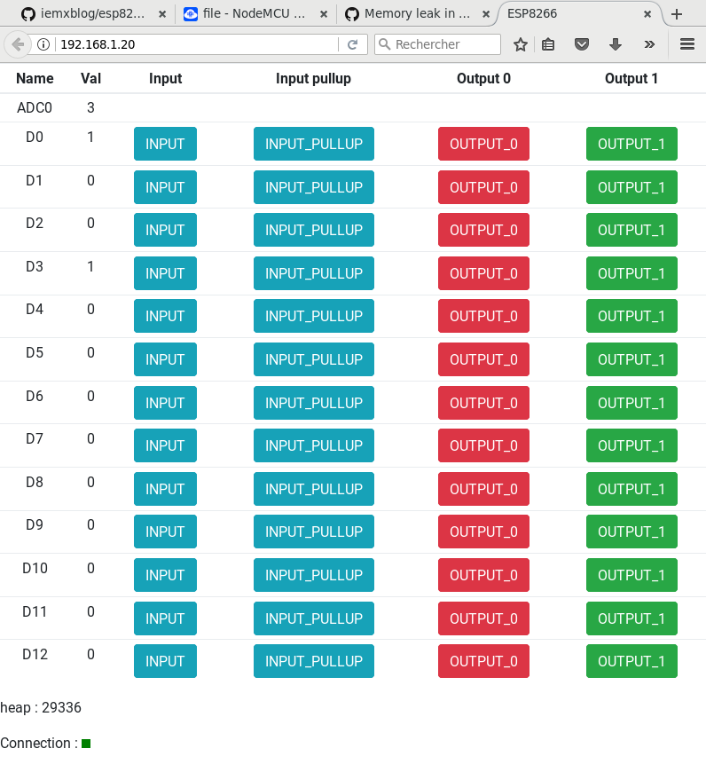

# ESP8266 Web Interface
This application allows to set pins states of the ESP8266 using a web interface. 

# Screenshot

# How to install it

## Install NodeMCU
First, follow the instructions [here](https://nodemcu.readthedocs.io/en/master/en/) on how to [build](https://nodemcu.readthedocs.io/en/master/en/build/) and how to [flash](https://nodemcu.readthedocs.io/en/master/en/flash/) NodeMCU on your ESP8266 board.

## Install the app 

~~~~~
$ git clone https://github.com/iemxblog/esp8266-web-interface
$ cd esp8266-web-interface
$ ./download-luatool.sh
~~~~~

Plug your ESP8266 board in.

~~~~~
$ ./initial_install.sh
~~~~~

Open the serial port using minicom :

~~~~~
$ minicom -b 115200 -D /dev/ttyUSB0
~~~~~

Then configure the wifi inside minicom :

~~~~~
> wifi.setmode(wifi.STATION)
> wifi.sta.config("SSID", "password")
> print(wifi.sta.getip())
192.168.1.20    255.255.255.0   192.168.1.1
~~~~~
Exit minicom using Control-a x. Then finish the installation using this command :

~~~~~
$ ./sync.sh 192.168.1.20
~~~~~

And finally open http://192.168.1.20/ with your web browser. Modify the IP address accordingly.
